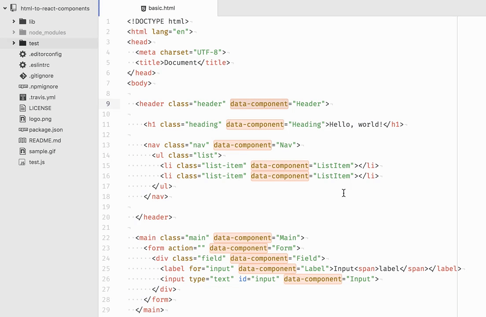

<a href="https://travis-ci.org/roman01la/html-to-react-components">
  
</a>
<a href="https://www.npmjs.com/package/html-to-react-components">
  
</a>

Extract annotated portions of HTML into React components as separate modules. The structure of HTML is preserved by importing child components and replacing appropriate pieces of HTML with them. As a result you get an entire components tree ready to be rendered.



## When to use it

This utility was designed to free React developers from a boring work of translating HTML into components.

Imagine you just got a pile of HTML from your designers. The first thing you will do is break HTML into React components. This is boring and we can automate this.

## Installation

```
$ npm i -g html-to-react-components
```

## Usage

HTML components should be annotated with `data-component` attribute. The value of the attribute is the name of the React component.

See and run `test.js` file for usage example and output or watch a [video](https://www.youtube.com/watch?v=Cd8cNLfGcVo) of the process.

### CLI

```
$ html2react ./src/*.html -c stateless -m es6 -d _ -o components -e jsx
```

### API

```js
import extractReactComponents from 'html-to-react-components';

extractReactComponents(
`<!DOCTYPE html>
<html lang="en">
<head>
  <meta charset="UTF-8">
  <title>Document</title>
</head>
<body>

  <header class="header" data-component="Header">

    <h1 class="heading" data-component="Heading">Hello, world!</h1>

    <nav class="nav" data-component="Nav">
      <ul class="list">
        <li class="list-item" data-component="ListItem">#1</li>
        <li class="list-item" data-component="ListItem">#2</li>
      </ul>
    </nav>

  </header>

</body>
</html>
`,
{
  componentType: 'stateless',
  moduleType: false
});

/*
{ Header: 'const Header = () => <header className="header">\n\n    <Heading></Heading>\n\n    <Nav></Nav>\n\n  </header>;',
  Heading: 'const Heading = () => <h1 className="heading">Hello, world!</h1>;',
  Nav: 'const Nav = () => <nav className="nav">\n      <ul className="list">\n        <ListItem></ListItem>\n        <ListItem></ListItem>\n      </ul>\n    </nav>;',
  ListItem: 'const ListItem = () => <li className="list-item">#2</li>;' }
*/
```

## Options

### componentType, -c

Type of generated React components.

Values:

- `stateless`
- `es5` (default)
- `es6`

### moduleType, -m

Type of generated JavaScript modules.

Values:

- `false` (do not extract components as modules)
- `es6` (default)
- `cjs` (CommonJS)

### moduleFileNameDelimiter, -d

Delimiter character to be used in modules filename.

If you don't specify a delimiter, or pass -d without a value, then the component
name in the HTML will be used unchanged as the filename. If you do specify a
delimiter character, then the module name is broken into words, joined with the
delimiter and lower-cased.

### output

Configuration options for output to file system.

#### path, -o

Output directory path.

Default is `components` directory in the current directory.

#### fileExtension, -e

Output files extension.

Default value is `js`.

## Contribution
If you spotted a bug, please, submit a pull request with a bug fix. If you would like to add a feature or change existing behaviour, open an issue and tell about what exactly you want to change/add.

## License

MIT
